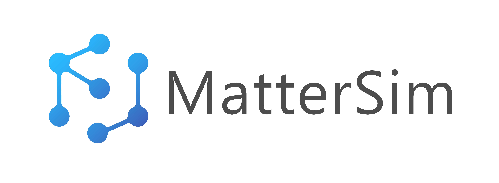

<h1>
<p align="center">
    
</p>
</h1>

<!-- <h1 align="center">MatterSim</h1> -->

<h4 align="center">

[](https://arxiv.org/abs/2405.04967)
[](https://python.org/downloads)

</h4>


MatterSim is a deep learning atomistic model across elements, temperatures and pressures.

## Installation
### Install from PyPI
> [!TIP]
> While not mandatory, we recommend creating a clean conda environment before installing MatterSim to avoid potential package conflicts. You can create and activate a conda environment with the following commands:
>
> ```bash
> # create the environment
> conda create -n mattersim python=3.9
>
> # activate the environment
> conda activate mattersim
> ```
>

To install MatterSim, run the following command:
```bash
pip install mattersim
```

In case you want to install the package with the latest version, you can run the following command:

```bash
pip install git+https://github.com/microsoft/mattersim.git
```

### Install from source code
1. Download the source code of MatterSim and change to the directory

    ```bash
    git clone git@github.com:microsoft/mattersim.git
    cd mattersim
    ```

2. Install MatterSim

    > [!WARNING]
    > We strongly recommend that users install MatterSim using [mamba or micromamba](https://mamba.readthedocs.io/en/latest/index.html), because *conda* can be significantly slower when resolving the dependencies in environment.yaml.

    To install the package, run the following command under the root of the folder:

    ```bash
    mamba env create -f environment.yaml
    mamba activate mattersim
    pip install -e .
    python setup.py build_ext --inplace
    ```

## Usage
### A minimal test
```python
import torch
from ase.build import bulk
from ase.units import GPa
from mattersim.forcefield import MatterSimCalculator

device = "cuda" if torch.cuda.is_available() else "cpu"
print(f"Running MatterSim on {device}")

si = bulk("Si", "diamond", a=5.43)
si.calc = MatterSimCalculator(device=device)
print(f"Energy (eV)                 = {si.get_potential_energy()}")
print(f"Energy per atom (eV/atom)   = {si.get_potential_energy()/len(si)}")
print(f"Forces of first atom (eV/A) = {si.get_forces()[0]}")
print(f"Stress[0][0] (eV/A^3)       = {si.get_stress(voigt=False)[0][0]}")
print(f"Stress[0][0] (GPa)          = {si.get_stress(voigt=False)[0][0] / GPa}")
```


## Reference
We kindly request that users of MatterSim version 1.0.0 cite our preprint available on arXiv:
```
@article{yang2024mattersim,
      title={MatterSim: A Deep Learning Atomistic Model Across Elements, Temperatures and Pressures},
      author={Han Yang and Chenxi Hu and Yichi Zhou and Xixian Liu and Yu Shi and Jielan Li and Guanzhi Li and Zekun Chen and Shuizhou Chen and Claudio Zeni and Matthew Horton and Robert Pinsler and Andrew Fowler and Daniel Zügner and Tian Xie and Jake Smith and Lixin Sun and Qian Wang and Lingyu Kong and Chang Liu and Hongxia Hao and Ziheng Lu},
      year={2024},
      eprint={2405.04967},
      archivePrefix={arXiv},
      primaryClass={cond-mat.mtrl-sci},
      url={https://arxiv.org/abs/2405.04967},
      journal={arXiv preprint arXiv:2405.04967}
}
```

> [!IMPORTANT]
> We kindly ask users to **explicitly** specify the exact model version and checkpoint (e.g., **MatterSim-v1.0.0-1M**) when reporting results in academic papers or technical reports, rather than referring to the model generically as **MatterSim**. Precise versioning is crucial for ensuring reproducibility. For instance, the statement "_This study was conducted using MatterSim-v1.0.0-1M_" serves as a good example.

## Limitations
**MatterSim-v1** is designed specifically for atomistic simulations of bulk materials. Applications or interpretations beyond this scope should be approached with caution. For instance, when using the model for simulations involving surfaces, interfaces, or properties influenced by long-range interactions, the results may be qualitatively accurate but are not suitable for quantitative analysis. In such cases, we recommend fine-tuning the model to better align with the specific application.

## Trademarks

This project may contain trademarks or logos for projects, products, or services.
Authorized use of Microsoft trademarks or logos is subject to and must follow [Microsoft's Trademark & Brand Guidelines](https://www.microsoft.com/en-us/legal/intellectualproperty/trademarks/usage/general).
Use of Microsoft trademarks or logos in modified versions of this project must not cause confusion or imply Microsoft sponsorship.
Any use of third-party trademarks or logos are subject to those third-party's policies.

## Responsible AI Transparency Documentation
The responsible AI transparency documentation can be found [here](MODEL_CARD.md).


## Researcher and Developers
MatterSim is actively under development, and we welcome community engagement. If you have research interests related to this model, ideas you’d like to contribute, or issues to report, we encourage you to reach out to us.
